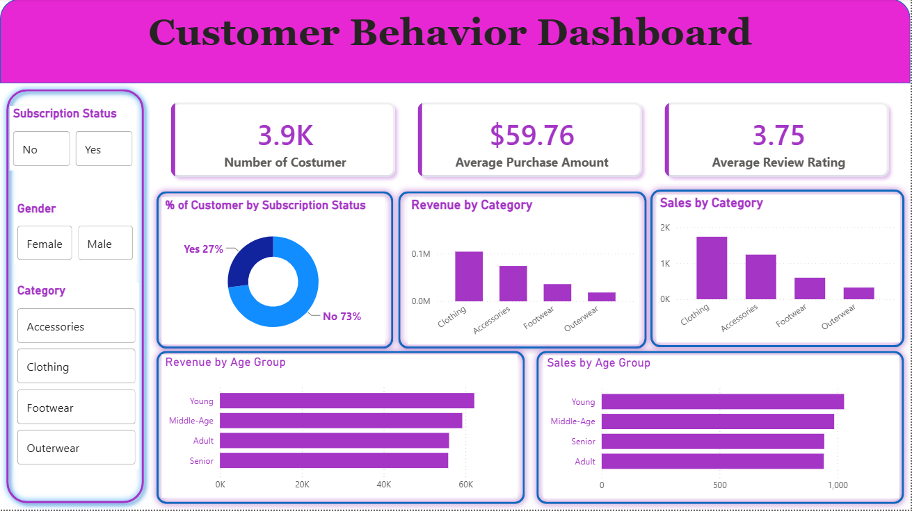

# Customer Behavior — Retail Shopping Trends Analysis

Complete, end-to-end data analytics portfolio project analyzing **Customer Shopping Trends** from retail data. The pipeline goes from raw CSV data → SQL exploratory analysis → Python EDA → an interactive Power BI dashboard, mirroring an industry-standard analytics workflow.

## Project Overview

This project explores customer purchasing behavior in a retail dataset to answer questions like:

- Which gender/segment drives the most revenue?
- Do discounts actually change purchasing behavior?
- Which products have the highest ratings and highest discount usage?
- Does a subscription correlate with higher spend?
- How do customers segment into New / Returning / Loyal buyers?
- What are the top-selling products within each category?
- How does revenue break down by age group and shipping type?

## Repository Structure

```
Customer_Behavior/
├── customer_shopping_behavior.csv          # Raw dataset (retail transactions)
├── Customer_behavior_eda.sql               # SQL exploratory data analysis
├── Customer_Shopping_Behavior_Analysis.ipynb  # Python EDA notebook (pandas)
├── customer_behavior-dashboard.pbix        # Power BI interactive dashboard
├── images/                                 # Dashboard/report screenshots
└── README.md

```

## Dataset

`customer_shopping_behavior.csv` contains retail transaction-level records. Key fields used throughout the analysis include:

| Column | Description |
|---|---|
| `customer_id` | Unique identifier for each customer |
| `gender` | Customer gender |
| `age_group` | Customer age bracket |
| `item_purchased` | Product/item bought |
| `category` | Product category |
| `purchase_amount` | Transaction value |
| `review_rating` | Customer's rating of the purchased item |
| `discount_applied` | Whether a discount was used (Yes/No) |
| `shipping_type` | Shipping method (Standard, Express, etc.) |
| `subscription_status` | Whether the customer is a subscriber |
| `previous_purchases` | Count of the customer's prior purchases |

> Exact column names/types should be confirmed against the CSV header, since minor naming differences can exist between the raw file and the SQL table schema.


## Analysis Workflow

1. **SQL (`Customer_behavior_eda.sql`)** — Loads the data into a working table and runs exploratory queries: revenue by gender, discount-driven high spenders, top-rated products, spend by shipping type, subscriber vs. non-subscriber revenue, discount rate by product, customer segmentation (New/Returning/Loyal) via a `CASE` + CTE, top-3 products per category using `ROW_NUMBER() OVER (PARTITION BY ...)`, repeat-buyer subscription likelihood, and revenue by age group.
2. **Python (`Customer_Shopping_Behavior_Analysis.ipynb`)** — Data cleaning, exploratory data analysis, and visualization using pandas (and typically matplotlib/seaborn) to validate and extend the SQL findings.
3. **Power BI (`customer_behavior-dashboard.pbix`)** — An interactive dashboard consolidating the above insights into KPI cards, trend charts, and comparative visuals for business-facing reporting.

## Key Insights (from the SQL analysis)

- Revenue is compared across **gender** to identify the higher-spending segment.
- Customers who use a **discount but still spend above the average** purchase amount are identified — a signal of price-insensitive, high-value shoppers.
- The **top 5 highest-rated products** and the **top 5 products with the highest discount usage rate** are surfaced separately, useful for merchandising decisions.
- Customers are segmented into **New** (1 prior purchase), **Returning** (2–10), and **Loyal** (10+) tiers.
- **Top 3 best-selling products per category** are ranked using a window function.
- Revenue is broken down by **age group** to identify the most valuable demographic.

### 🔹 Dashboard Preview:

#### Sales Overview Dashboard



## Tools & Technologies

- **SQL** (MySQL syntax) — data staging and exploratory analysis
- **Python** (pandas) — EDA and data cleaning in Jupyter Notebook
- **Power BI** — interactive dashboarding and reporting

## Getting Started

See [SETUP.md](./SETUP.md) for full installation and run instructions.
